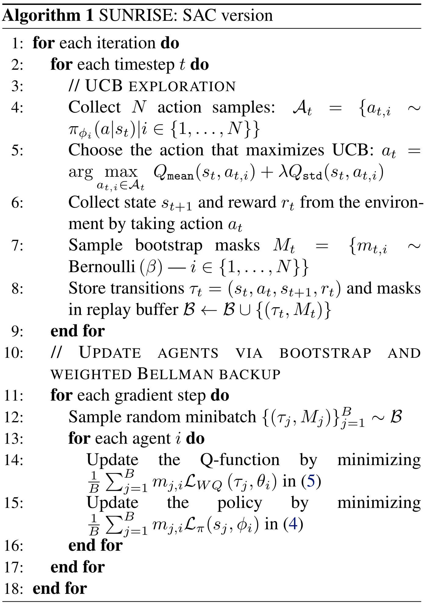
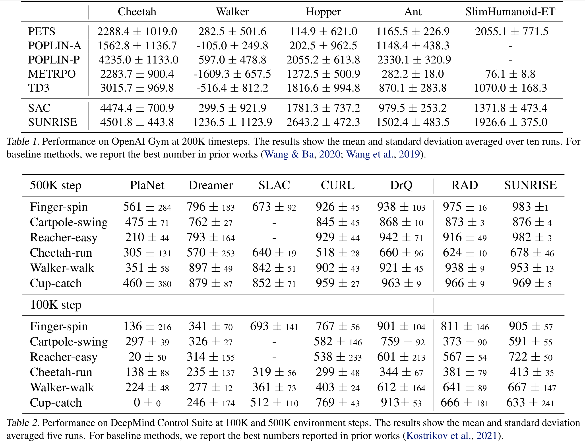

# SUNRISE

- 제목: SUNRISE: A Simple Unified Framework for Ensemble Learning in Deep Reinforcement Learning
- 저자: Lee, Kimin, Michael Laskin, Aravind Srinivas, and Pieter Abbeel, *UC Berkeley*
- 연도: 2021년
- 학술대회:International Conference on Machine Learning
- 링크: [https://proceedings.mlr.press/v139/lee21g.html](https://proceedings.mlr.press/v139/lee21g.html)
- 키워드: Agent ensemble, Uncertainty, Off-policy, Model-free, Discrete & continouse action space

 

---

SUNRISE에는 $N$개의 Soft Actor-critic (SAC) 에이전트가 있다 (SAC는 하나의 예시이며, Rainbow DQN 등을 사용할 수도 있다.). 즉, $N$개의 정책과 Q-네트워크 $\left\{ Q_{\theta_i}, \pi_{\phi_i} \right\}_{i=1}^{N}$가 있다. 참고로 실험에서 $N=5$이다. 네트워크 파라미터 $\theta_i, \phi_i$들은 모두 서로 다르게 랜덤 초기화된다. 이렇게 다수개의 네트워크를 사용하여 본 논문에서는 다음 세 가지를 제안한다.

1. Weighted Bellman Backups
   - Q-네트워크 학습시, 각 transition에서 발생한 TD error에 가중치를 부여하여 업데이트
2. Bootstrap with random initialization
   - $N$개의 정책 네트워크 및 Q-네트워크를 서로 다른 파라미터로 초기화시키기 때문에 다양한 관점을 가진 네트워크를 얻을 수 있다.
   - Replay buffer는 공유하지만, 에이전트마다 각 샘플을 사용할지 안 할지 마스킹하여 에이전트마다 다른 데이터를 가지고 학습된다.
3. UCB exploration
   - 행동을 선택할 때 Q-network 값의 평균과 분산을 UCB로 

 

---

## Weighted Bellman Backups

일반적인 SAC는 다음 Bellman error를 최소화시키는 방법으로 Q-네트워크를 학습시킨다.

$$
\mathcal{L}_Q(\tau_t, \theta) = \left( Q_{\theta} (s_t, a_t) - r_t + \gamma \bar{V}(s_{t+1})\right)^2,
$$

이때, $\tau_t=(s_t, a_t, r_t, s_{t+1})$는 하나의 transition이고, $\bar{V}(s_t) = \mathbb{E}_{a_t \sim \pi_{\phi}}\left[ Q_{\bar{\theta}}(s_t, a_t) - \alpha \log \pi_{\phi}(a_t | s_t)\right]$, $\alpha$는 temperature 하이퍼파라미터이다.

SUNRISE에서는 $i$번째 Q-네트워크를 학습시키기 위해 다음과 같은 weighted Bellman backup을 사용한다.

$$
\mathcal{L}_{WQ}(\tau_t, \theta_i) = w(s_{t+1}, a_{t+1})\left( Q_{\theta} (s_t, a_t) - r_t + \gamma \bar{V}(s_{t+1})\right)^2,
$$

이때, 가중치 함수 $w(s, a)$는 다음과 같이 정의된다.

$$
w(s, a) = \sigma \left( - \bar{Q}_{\text{std}}(s, a) * T\right) + 0.5,
$$

여기서 $T>0$은 tempertature 하이퍼파라미터이고, $\sigma$는 시그모이드 함수이다. $\bar{Q}_{\text{std}}(s, a)$는 $N$개의 $Q_{\theta_i}(s, a)$들에 대한 표본표준편차이다. 표준편차는 항상 양수이기 때문에 $- \bar{Q}_{\text{std}}(s, a) * T$는 항상 음수이고, 따라서 $\sigma \left( - \bar{Q}_{\text{std}}(s, a) * T\right)$는 0과 0.5 사이의 값을 갖는다. 여기에 0.5를 더해주었으니 $w(s, a)$는 0.5와 1 사이의 값을 갖는다. 경험적 (emperically) 으로 가중치 함수를 이렇게 디자인했다고 한다. 표준편차 클 수록 샘플에 낮은 가중치를 부여하고, 표준편차가 작을수록 높은 가중치를 부여한다. 표준편차가 크다는 것을 Q-함수 추정값에 많은 잡음 (noise)이 들어갔다고 생각하여 낮은 가중치를 주는 것이다.

 

---

## Bootstrap with random initialization

네트워크 파라미터 $\theta_i, \phi_i$들은 모두 서로 다르게 랜덤 초기화하고, 각 에이전트를 서로 다른 샘플로 학습을 시킨다. Replay buffer는 공유하지만 각 transition $\tau_t=(s_t, a_t, r_t, s_{t+1})$를 버퍼에 넣기 전에 에이전트마다 해당 $\tau_t$를 사용할지 안 할지를 결정하는 bootstrap 마스크 $M_t = \{ m_{t, i} \}_{i=1}^{N}$를 만들어서 넣는다. 각 타임스탭 $t$에서 각 에이전트 $i$마다 $\beta$를 파라미터로 갖는 Bernouli 분포에서 $m_{t,i} \in \{ 0,1\}$를 샘플링한다. 정책 네트워크 및 Q-네트워크 업데이트시 손실함수를 만들 때 각 에러에 $m_{t,i} \in \{ 0,1\}$를 에러에 곱해줘서 손실함수에 기여하거나 기여할 수 없게 만든다. 그런데 $\beta=1$일 때 성능이 좋았다고 한다. 즉, 그냥 데이터 다 사용하는게 좋다고 한다.

 

---

## UCB exploration

매 타임스탭 $t$에서 다음과 같이 행동을 고른다.

$$
a_t = \operatorname*{argmax}_{a} \left\{ Q_{\text{mean}}(s_t, a) + \lambda Q_{\text{std}}(s_t, a) \right\},
$$

$Q_{\text{mean}}$와 $Q_{\text{std}}$는 각각 $N$개의 $Q_{\theta_i}(s_t, a)$들에 대한 표본 평균과 표본 표준편차이다. 표준편차가 클수록 탐색이 덜 된 상태-행동 순서쌍으로 보고 탐색을 하게 만든다. $Q_{\theta_i}(s_t, a)$들이 점점 수렴하게 되어 표준편차가 작아지면 $Q_{\text{mean}}(s_t, a)$가 큰 행동을 취하게 된다.

 

---

## Algorithm

 

---

## Result

 

---

## Reference

Lee, Kimin, Michael Laskin, Aravind Srinivas, and Pieter Abbeel. “SUNRISE: A Simple Unified Framework for Ensemble Learning in Deep Reinforcement Learning.” In Proceedings of the 38th International Conference on Machine Learning, 6131–41. PMLR, 2021. https://proceedings.mlr.press/v139/lee21g.html.
